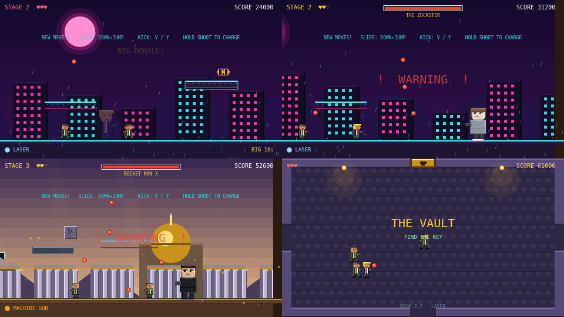

# Operation: Freedom Force

A Contra-style parody run-and-gun. Political satire in 16-bit dress: side-scrolling
stages, absurdly overwrought action-movie framing, and boss fights against caricatures
of public figures.

**▶ [Play it in your browser](https://madmartigan1.github.io/freedom-force/)**



*Clockwise from top left: BIG DONALD in the Stage 2 rain, THE ZUCKSTER, a room
in THE VAULT, and ROCKET MAN X. Shown with the CRT filter off — press `C` in
game to turn it on.*

Runs in a browser. No build step, no install, no network. Every sprite you can
see and every sound you can hear is generated at runtime; there is not a single
image or audio file in this repository.

## Play

Easiest is the [hosted version](https://madmartigan1.github.io/freedom-force/).

To run it locally:

```
python3 serve.py
```

Then open <http://localhost:8000>. (`serve.py` is `http.server` with caching
disabled, so edits always show up on refresh.)

Opening `index.html` directly with `file://` mostly works, but a local server is
the reliable path — WebAudio and the Gamepad API both prefer a real origin.

The title screen has a stage select: **1**-**3** for the side-scrolling stages,
**4** to go straight to the dungeon.

## Controls

| Action  | Keyboard              | Xbox pad        |
| ------- | --------------------- | --------------- |
| Move    | Arrows / WASD         | Stick / D-pad   |
| Jump    | Space or Z            | A               |
| Shoot   | X or J                | X               |
| Slide   | Down + Jump           | Down + A        |
| Kick    | V                     | Y               |
| Ride    | Up (next to THE BEAST)| Up / D-pad Up   |
| Eject   | V *or* Down+Jump      | Y *or* Down+A   |
| Restart | R                     | —               |
| Mute    | M                     | —               |
| CRT on/off | C                  | —               |
| Start   | Enter / Space         | Any button      |

Hold shoot to build a charge shot. Slide and kick unlock in Stage 2.

## CRT filter

A post-processing shader (`crt.js`) emulates a CRT tube: scanlines, aperture
grille, barrel distortion, phosphor bloom, chromatic aberration, mains-hum
flicker and vignette. On by default, toggled with **C**.

WebGL only. Under the Canvas renderer every entry point is a no-op and the game
renders undistorted rather than failing.

Barrel distortion is deliberately gentle (`k = 0.030`). Stronger curvature pushes
the HUD at `(8, 6)` off the edge of the tube — at `0.055` roughly two-thirds of
the score line's lit pixels are lost.

## Health and secrets

Hearts replace the old three-lives model: a hit chips one heart rather than
ending a life outright.

- **Heart containers** permanently raise your maximum (up to 8) and **carry
  across stages**, so searching early makes the later stages survivable.
- **Heart refills** top you back up.
- **Cracked blocks** are scattered through every stage. They read as scenery —
  the hairline crack is the only tell. Shoot one three times and it shatters,
  revealing a container, a refill or a weapon pod. A few sit on ledges you can
  only reach from one specific platform.
- The stage-clear screen tallies how many you found.

## Weapons

Three pods are scattered through each stage. Run into one to swap weapon; you
keep it until the stage ends.

| Pod | Weapon | Behaviour |
| --- | ------ | --------- |
| **M** | Machine gun | 75ms cadence — roughly twice the rifle's rate |
| **S** | Spread | Five-way fan, one damage each |
| **L** | Laser | Pierces every enemy in the line, two damage |

Anything other than the default rifle overrides Stage 2's charge shot. A power-up
should read as a straight upgrade, not a trade against a mechanic you already have.

## Sound

Every sound is synthesised at runtime from oscillators and filtered noise — no
audio files, the same approach as the sprites. Fifteen effects plus a driving
chiptune loop per stage (bass, arp lead and a noise kit) run by a lookahead
scheduler, so timing does not drift with the frame rate.

Browsers refuse to start an AudioContext before a user gesture, so audio arms
itself on the first keypress or button. **M** mutes.

## BIG DONALD

Somewhere in every stage there is a burger — one in the open, one behind a
cracked block. Eat it and, in the spirit of Bonk's Adventure, the Donald gets
enormous for thirteen seconds.

- **Nearly twice the size**, and shots hit for 3 instead of 1.
- **Bodies cannot hurt you.** Getting shot does not cost a heart either — it
  takes time off the clock instead.
- **Landing hard flattens whatever is underneath**, cracked blocks included,
  and simply walking into a grunt squashes it.
- He flashes for the last three seconds so it never just runs out on you, and
  eating another burger refreshes the clock.

Mounting THE BEAST ends it early — one oversized hitbox at a time.

## THE BEAST

Partway into every stage sits a gilded armoured carriage. Walk up and press **Up**
to climb aboard.

- **8 armour.** Hits chip the armour instead of costing a life; at zero it blows up
  and throws the Donald clear with mercy-invincibility.
- **Cannon** — heavy shells, 3× a normal bullet's damage, angled with up/down.
- **Ram** — flattens grunts on contact, staggers a boss.
- Faster than running, with a heavier jump. **V / Y** or **Down+Jump** to step
  out; it keeps whatever armour is left, so you can come back for it. A prompt
  floats above the carriage the whole time you are aboard.

## THE VAULT

A top-down Zelda-style dungeon, reached after Stage 3. Gravity is off, movement
and shooting are 8-way, and the camera snaps room to room rather than scrolling,
the way A Link to the Past does.

- **Nine rooms** in a 3x3 grid. Walk off a screen edge to move between them;
  each populates itself the first time you enter.
- **Find the small key**, then stand at the locked door and press **Space / A**
  to open it. The boss chamber is behind it.
- Rooms hide a heart container, refills and weapon pods.
- Your hearts, score and weapon carry in from Stage 3.

## Stages

1. **City** — 8-bit classic styling. Boss: `BARACK O.` (10 HP)
2. **Neon** — enhanced tech styling, new moves. Boss: `THE ZUCKSTER` (16 HP)
3. **Marble** — dawn over a gilded capitol. Boss: `ROCKET MAN X` (22 HP)
4. **THE VAULT** — top-down dungeon. Boss: `THE GOLDEN IDOL` (20 HP)

## How it's built

- **Phaser 3.80.1**, vendored in `vendor/` — not loaded from a CDN. The game is fully
  self-contained and plays offline, forever, with no package manager involved.
- **Zero art assets.** Every sprite is drawn procedurally at runtime by `drawHumanoid()`
  in `game.js`, using a beveled light/shadow box routine (`shbox`) to fake the 16-bit
  shaded look. Nothing to lose, nothing to re-export.
- **Plain scripts, no modules or bundler.** Load order matters and is fixed in
  `index.html`: `dungeon.js` reads constants from `game.js` at load time, while
  `game.js` needs `DungeonScene` for its scene list, so the `Phaser.Game` call
  lives alone in `main.js` and loads last.

```
index.html   page shell + canvas styling
game.js      side-scrolling stages, sprites, most gameplay
dungeon.js   THE VAULT — the top-down dungeon scene
crt.js       CRT post-processing shader
audio.js     procedural chiptune + SFX
main.js      Phaser bootstrap; loads last, see its header
vendor/      Phaser, committed on purpose
```

## Non-goals

Written down deliberately. This is a small parody game and the fastest way to kill it
is to let it become something else.

- **Not an ever-expanding stage list.** New stages need a reason beyond "one more" —
  a mechanic, a set piece, a joke that needs the room.
- **No build step.** No bundler, no transpiler, no `npm install`. Editing `game.js` and
  hitting refresh stays the entire development loop.
- **No external assets the game loads.** Sprites stay procedural and sound stays
  synthesised. No image files, no sprite sheets, no audio files. Screenshots in
  `docs/` do not count — nothing at runtime touches them.
- **No backend, accounts, or online play.** It is a local single-player game.
- **Not a balanced competitive game.** It is a joke with good game feel.

## Notes

Every script tag carries a `?v=` cache-buster that must match `BUILD` in
`game.js`, and both go up whenever a script changes — without that, a returning
browser will happily reuse the `game.js` it already has. The title screen shows
the build it is running, so you can tell at a glance what you are looking at.

## Contributing

Issues and pull requests are welcome — see [CONTRIBUTING.md](CONTRIBUTING.md)
for how to run it and the few constraints worth knowing about (no build step,
no asset files, and a load order that matters).

## License

[MIT](LICENSE). Phaser is vendored in `vendor/` and is MIT-licensed too.

The game is political satire. The code is yours to do as you like with; the
joke is its own business.
